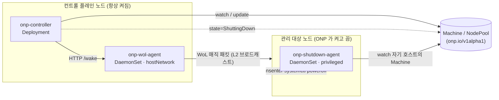

# ONP — On-Prem Node Provisioner

Pending 파드의 spec 을 보고 적합한 on-prem 물리 노드를 Wake-on-LAN 으로 깨우고, 비면 안전하게 drain 후 전원을 끄는 Kubernetes 컨트롤러. 전원 제어는 pluggable.

## 상태

**Phase 1 진행 중** — Helm 차트로 설치는 가능하나, 설치 가이드·샘플 매니페스트 정비(M5)는 아직입니다.

- ✅ **M1 — Walking Skeleton**: WoL 매직 패킷 빌더 + `wol-probe` CLI (표준 라이브러리만) + 멀티스테이지 Docker 이미지. 같은 L2 의 실제 꺼진 노드를 깨우는 것까지 end-to-end 검증 완료.
- ✅ **M2 — 최소 컨트롤러**: `Machine` CRD + 컨트롤러 + `onp-wol-agent` 로 선언적 wake (`onp.io/wake-now` 어노테이션).
- ✅ **M3 — 자동 scale-up**: `NodePool` CRD + fit 시뮬레이션으로 pending 파드에 맞는 노드를 자동 wake (`maxNodes`/`cooldown` 가드 포함). 실하드웨어 E2E 검증 — wake 부터 파드 스케줄까지 ~40초.
- ✅ **M4 — Safe Shutdown**: 빈 노드를 자동 drain(PDB 존중) 후 전원 차단. 상태 전이 `Ready → Draining → ShuttingDown → Off`. 실하드웨어 E2E 검증 — 성공경로(빈 노드 자동 종료) + 안전경로(PDB 로 보호된 노드는 drain timeout 시 `Failed` + uncordon, 데이터 무중단) 모두 통과.
- ⏳ **M5 — 운영 폴리시 + 배포**: `minNodes`/`maxConcurrent`/`do-not-disrupt`/cooldown, leader election, `/metrics`, 설치 가이드 (다음 차례).

전체 마일스톤(M1 → M5)은 [`ROADMAP.md`](ROADMAP.md) 참조.

## 아키텍처

ONP 는 세 컴포넌트로 나뉩니다. 한 바이너리로 합치지 않는 이유는 보안 표면 때문입니다 — WoL 매직 패킷은 L2 브로드캐스트라 **호스트 네트워크**가 필요하고, 전원을 끄려면 대상 노드 위에서 **특권 명령**을 실행해야 합니다. 둘을 컨트롤러와 합치면 권한이 과해집니다.

### 컴포넌트

- **`onp-controller`** (Deployment, leader-elected) — 두뇌. `Pod`/`Node`/`Machine`/`NodePool` 을 watch 하며 `Machine.status.state` 상태 머신을 구동한다. pending 파드에 맞는 꺼진 노드를 고르는 **scale-up** 선정, 빈 노드를 끄는 **scale-down** 선정, **drain 오케스트레이션**(cordon → Eviction API → ShuttingDown)이 여기 있다. RBAC 는 최소 — Pod/Node read, Eviction, Machine/NodePool RW. 선정 로직은 직접 전원을 만지지 않고 어노테이션(`onp.io/wake-now`, `onp.io/drain-now`)을 달아 상태 머신을 태우므로, 수동·자동 경로가 한 코드 경로를 공유한다.

- **`onp-wol-agent`** (DaemonSet, `hostNetwork: true`, 항상 켜진 노드에만) — 컨트롤러의 wake 전송부. `POST /wake` 를 받아 같은 L2 세그먼트로 매직 패킷을 브로드캐스트한다. **Kubernetes 의존성 0** — 클러스터 API 를 전혀 만지지 않는 순수 네트워크 데몬이라 ClusterRole 도 없다. (라우팅 경계 너머로는 L2 브로드캐스트가 안 넘으므로 컨트롤러와 분리되어 있다.)

- **`onp-shutdown-agent`** (DaemonSet, `privileged: true`, 관리 대상 노드에만) — 전원 차단부. **자기 호스트의 `Machine` 만** watch 하다가 `state == ShuttingDown` 을 보면 `nsenter` 로 PID 1 네임스페이스에 들어가 `systemctl poweroff` 를 실행한다(graceful — 멱등 보장). 컨트롤러와는 직접 RPC 가 아니라 `Machine.status` watch 로 조율하므로, 컨트롤러가 재시작해도 idempotent 하고 별도 통신 채널이 필요 없다.

### CRD

- **`Machine`** — 개별 물리 노드 하나. 정체성(`nodeName`), 꺼진 상태에서의 fit 체크용 `capacity`, 전원 설정(`power.provider` + provider별 config), 그리고 **상태 머신의 source of truth** 인 `status.state`(`Off → Booting → Ready → Draining → ShuttingDown → Off` / `Failed`).
- **`NodePool`** — 라벨로 묶인 노드 그룹의 정책. `minNodes`/`maxNodes`, `disruption`(`WhenEmpty` + `consolidateAfter`), `cooldown`, `drain`(timeout, force).

### Power Provider (pluggable)

전원-켜기 메커니즘은 `PowerProvider` 인터페이스(`PowerOn`/`PowerOff`/`PowerStatus`/`Capabilities`) 뒤에 숨어 있다. 호출 측은 `Capabilities()` 를 보고 분기하므로, IPMI/Redfish 추가는 **새 구현체 등록만**으로 끝난다. Phase 1 은 WoL(`{CanPowerOn: true}`)만 — 끄기는 항상 shutdown-agent 경로이고, `PowerOff` 는 이후 hard-cut fallback 용 자리만 잡아 뒀다.

## 문서

- [`docs/DESIGN.md`](docs/DESIGN.md) — 설계 문서 (Google 스타일)
- [`CLAUDE.md`](CLAUDE.md) — 코드 작성 가이드
- [`ROADMAP.md`](ROADMAP.md) — 마일스톤 (M1 → M5)

## License

[Apache License 2.0](LICENSE)
