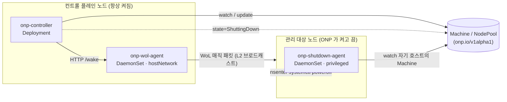

# ONP — On-Prem Node Provisioner

Pending 파드의 spec 을 보고 적합한 on-prem 물리 노드를 Wake-on-LAN 으로 깨우고, 비면 안전하게 drain 후 전원을 끄는 Kubernetes 컨트롤러. 전원 제어는 pluggable.

## 상태

**Phase 1 (MVP) 코드 완료** — M1~M5 구현 완료. M5 의 클린 클러스터 E2E 재검증만 남았습니다.

- ✅ **M1 — Walking Skeleton**: WoL 매직 패킷 빌더 + `wol-probe` CLI (표준 라이브러리만) + 멀티스테이지 Docker 이미지. 같은 L2 의 실제 꺼진 노드를 깨우는 것까지 end-to-end 검증 완료.
- ✅ **M2 — 최소 컨트롤러**: `Machine` CRD + 컨트롤러 + `onp-wol-agent` 로 선언적 wake (`onp.io/wake-now` 어노테이션).
- ✅ **M3 — 자동 scale-up**: `NodePool` CRD + fit 시뮬레이션으로 pending 파드에 맞는 노드를 자동 wake (`maxNodes`/`cooldown` 가드 포함). 실하드웨어 E2E 검증 — wake 부터 파드 스케줄까지 ~40초.
- ✅ **M4 — Safe Shutdown**: 빈 노드를 자동 drain(PDB 존중) 후 전원 차단. 상태 전이 `Ready → Draining → ShuttingDown → Off`. 실하드웨어 E2E 검증 — 성공경로(빈 노드 자동 종료) + 안전경로(PDB 로 보호된 노드는 drain timeout 시 `Failed` + uncordon, 데이터 무중단) 모두 통과.
- ✅ **M5 — 운영 폴리시 + 배포**: `minNodes` 하한, `maxConcurrent`, `onp.io/do-not-disrupt`(Node/Pod), `cooldown.scaleDown`, 외부 노드 손실/shutdown 타임아웃 처리, leader election wiring, `onp_*` `/metrics` 5종, Helm 차트 마감(PSA·lease RBAC). 클린 클러스터 E2E 재검증만 남음.

전체 마일스톤(M1 → M5)은 [`ROADMAP.md`](ROADMAP.md) 참조.

## 설치

전제: 클러스터의 노드들이 **이미 join 된** 상태여야 합니다 (ONP 는 전원만 다룹니다 — OS/kubelet 설치는 운영자 책임). 깨울 노드의 NIC 에 Wake-on-LAN 이 무장돼 있어야 합니다 (`ethtool -s <nic> wol g`).

```bash
# 1) 노드 라벨링 — 각 컴포넌트가 갈 곳을 정한다
kubectl label node <always-on-node> onp.io/always-on=true   # 컨트롤러 + wol-agent (항상 켜진 노드)
kubectl label node <wakeable-node>  onp.io/managed=true      # shutdown-agent (ONP 가 켜고 끄는 노드)

# 2) 설치 (이미지는 익명 pull 가능한 레지스트리에서. 기본 registry 는 ghcr.io/onp — 자체 레지스트리는 --set 으로 override)
helm install onp ./charts/onp -n onp-system --create-namespace \
  --set image.registry=<your-registry>

# PSA 를 강제하는 클러스터라면 privileged shutdown-agent 가 뜨도록 네임스페이스 라벨링
kubectl label ns onp-system pod-security.kubernetes.io/enforce=privileged
```

> 이미지를 직접 빌드한다면: controller/wol-agent 는 기본 타깃, **shutdown-agent 는 privileged 런타임**으로 빌드해야 합니다 (`nsenter` 필요) —
> `docker build --target runtime-privileged --build-arg BIN=onp-shutdown-agent ...`.

### 샘플 매니페스트

```yaml
apiVersion: onp.io/v1alpha1
kind: NodePool
metadata:
  name: edge
spec:
  minNodes: 0                 # 항상 켜둘 하한 (0 = 비면 전부 꺼도 됨)
  maxNodes: 5                 # 켤 수 있는 상한 (생략 시 무제한)
  machineSelector:
    matchLabels: { onp.io/pool: edge }
  template:
    labels: { onp.io/pool: edge }   # fit 시뮬레이션에 쓰는 노드 라벨
  disruption:
    consolidationPolicy: WhenEmpty
    consolidateAfter: 5m      # 빈 채로 이만큼 유지돼야 끔 (미설정 시 자동 scale-down off)
    maxConcurrent: 1          # 풀에서 동시에 drain 할 노드 수 (기본 1)
  cooldown:
    scaleUp: 30s
    scaleDown: 5m
  drain:
    timeoutSeconds: 300       # 초과 시 멈춤 + uncordon + Failed (force=false 기본)
    force: false
---
apiVersion: onp.io/v1alpha1
kind: Machine
metadata:
  name: worker-1
  labels: { onp.io/pool: edge }     # 이 라벨로 위 풀에 속한다
spec:
  nodeName: worker-1                # = Node.name (Phase 1)
  capacity: { cpu: "8", memory: 32Gi }   # 꺼진 상태 fit 체크의 source of truth
  power:
    provider: wol
    wol:
      macAddress: "aa:bb:cc:dd:ee:ff"
      # broadcastAddress: 192.168.1.255   # 생략 시 255.255.255.255
```

```bash
kubectl apply -f nodepool-and-machines.yaml

# 데모: 풀의 노드를 모두 끈 뒤 파드를 띄우면 적합한 노드가 자동으로 깨어난다
kubectl run demo --image=nginx --overrides='{"spec":{"nodeSelector":{"onp.io/pool":"edge"}}}'
kubectl get machines -w          # Off → Booting → Ready
```

수동 트리거도 가능합니다: `kubectl annotate machine worker-1 onp.io/wake-now=true` (wake) / `onp.io/drain-now=true` (drain).

## 운영 폴리시 (안전장치)

ONP 의 기본값은 **"조용히 데이터를 잃지 않는다"** 입니다 — 모호한 결과는 항상 `Failed` 로 가고, 파괴적 동작은 명시적 opt-in 입니다.

| Knob | 위치 | 동작 |
|---|---|---|
| `minNodes` | NodePool | 풀이 이 아래로 내려가는 scale-down 을 거절 (켜진 노드 하한). |
| `maxNodes` | NodePool | 이 위로 올라가는 scale-up 을 거절. |
| `disruption.maxConcurrent` | NodePool | 풀에서 동시에 drain 중인 노드 수 상한 (기본 1 = 직렬). |
| `disruption.consolidateAfter` | NodePool | 빈 채로 이만큼 유지돼야 끔. **미설정 시 자동 scale-down off.** |
| `cooldown.scaleUp` / `scaleDown` | NodePool | wake / power-off 결정 사이 최소 간격. |
| `drain.timeoutSeconds` | NodePool | drain 이 못 끝내면 멈춤 + uncordon + `Failed` (force 아님). |
| `drain.force` | NodePool | `true` 면 do-not-disrupt 파드도 evict (단, PDB 는 여전히 존중). 기본 `false`. |
| `onp.io/do-not-disrupt` | Node / Pod | Node 에 달면 그 노드는 자동 scale-down 제외. Pod 에 달면 그 노드는 "비지 않음"으로 취급돼 자동 종료 대상이 안 되고, 수동 drain 도 (force 아니면) 그 파드를 안 내린다. |

## 관측성

컨트롤러가 `/metrics` (`:8080`) 로 Prometheus 메트릭을 노출합니다 (`onp_` 접두사):

- `onp_nodes_total{pool,state}` — 풀·상태별 Machine 수 (gauge)
- `onp_scale_up_latency_seconds` — power-on → Node Ready 까지 (histogram)
- `onp_power_on_total{provider,result}` — power-on 명령 수 (counter)
- `onp_drain_failure_total{reason}` — 실패한 drain/power-off 수 (counter)
- `onp_pending_unschedulable` — 노드를 기다리는 unschedulable 파드 수 (gauge)

흐름은 Events 로도 따라갈 수 있습니다: `kubectl describe machine <name>` (Waking/Ready/Draining/ScaleDown/ScaleDownBlocked/NodeLost 등).

## 트러블슈팅

- **노드가 안 깨어남**: NIC WoL 무장(`ethtool <nic> | grep Wake-on` → `g`)을 확인하세요. 무장은 **비영속** — 재부팅 시 풀릴 수 있습니다 (ONP 외부, 노드 운영자 책임). wol-agent 와 대상 노드가 **같은 L2 세그먼트**여야 합니다 (브로드캐스트는 라우팅 경계를 못 넘음).
- **노드가 ICMP 를 막음**: liveness 는 ping 이 아니라 **Node Ready** 로 판정합니다 — 정상입니다.
- **scale-up 으로 깨운 노드가 스케줄 안 됨**: 이전 scale-down 이 남긴 cordon 일 수 있습니다. ONP 는 `Booting→Ready` 에서 **자기가 단 cordon(`onp.io/cordoned-by-onp`)만** 자동 해제합니다 (운영자 수동 cordon 은 건드리지 않음).
- **shutdown-agent 가 안 뜸**: 대상 노드에 `onp.io/managed=true` 라벨이 있는지, 네임스페이스가 privileged PSA 를 허용하는지 확인하세요.
- **자동 scale-down 이 안 일어남**: `disruption.consolidationPolicy: WhenEmpty` **와** `consolidateAfter` 가 **둘 다** 설정돼야 합니다 (둘 중 하나라도 없으면 off — 의도된 안전 기본값).

## 아키텍처

ONP 는 세 컴포넌트로 나뉩니다. 한 바이너리로 합치지 않는 이유는 보안 표면 때문입니다 — WoL 매직 패킷은 L2 브로드캐스트라 **호스트 네트워크**가 필요하고, 전원을 끄려면 대상 노드 위에서 **특권 명령**을 실행해야 합니다. 둘을 컨트롤러와 합치면 권한이 과해집니다.



### 컴포넌트

- **`onp-controller`** (Deployment, leader-elected) — 두뇌. `Pod`/`Node`/`Machine`/`NodePool` 을 watch 하며 `Machine.status.state` 상태 머신을 구동한다. pending 파드에 맞는 꺼진 노드를 고르는 **scale-up** 선정, 빈 노드를 끄는 **scale-down** 선정, **drain 오케스트레이션**(cordon → Eviction API → ShuttingDown)이 여기 있다. RBAC 는 최소 — Pod/Node read, Eviction, Machine/NodePool RW. 선정 로직은 직접 전원을 만지지 않고 어노테이션(`onp.io/wake-now`, `onp.io/drain-now`)을 달아 상태 머신을 태우므로, 수동·자동 경로가 한 코드 경로를 공유한다.

- **`onp-wol-agent`** (DaemonSet, `hostNetwork: true`, 항상 켜진 노드에만) — 컨트롤러의 wake 전송부. `POST /wake` 를 받아 같은 L2 세그먼트로 매직 패킷을 브로드캐스트한다. **Kubernetes 의존성 0** — 클러스터 API 를 전혀 만지지 않는 순수 네트워크 데몬이라 ClusterRole 도 없다. (라우팅 경계 너머로는 L2 브로드캐스트가 안 넘으므로 컨트롤러와 분리되어 있다.)

- **`onp-shutdown-agent`** (DaemonSet, `privileged: true`, 관리 대상 노드에만) — 전원 차단부. **자기 호스트의 `Machine` 만** watch 하다가 `state == ShuttingDown` 을 보면 `nsenter` 로 PID 1 네임스페이스에 들어가 `systemctl poweroff` 를 실행한다(graceful — 멱등 보장). 컨트롤러와는 직접 RPC 가 아니라 `Machine.status` watch 로 조율하므로, 컨트롤러가 재시작해도 idempotent 하고 별도 통신 채널이 필요 없다.

### CRD

- **`Machine`** — 개별 물리 노드 하나. 정체성(`nodeName`), 꺼진 상태에서의 fit 체크용 `capacity`, 전원 설정(`power.provider` + provider별 config), 그리고 **상태 머신의 source of truth** 인 `status.state`(`Off → Booting → Ready → Draining → ShuttingDown → Off` / `Failed`).
- **`NodePool`** — 라벨로 묶인 노드 그룹의 정책. `minNodes`/`maxNodes`, `disruption`(`WhenEmpty` + `consolidateAfter` + `maxConcurrent`), `cooldown`(scaleUp/scaleDown), `drain`(timeout, force). 자세한 안전장치는 아래 [운영 폴리시](#운영-폴리시-안전장치) 참조.

### Power Provider (pluggable)

전원-켜기 메커니즘은 `PowerProvider` 인터페이스(`PowerOn`/`PowerOff`/`PowerStatus`/`Capabilities`) 뒤에 숨어 있다. 호출 측은 `Capabilities()` 를 보고 분기하므로, IPMI/Redfish 추가는 **새 구현체 등록만**으로 끝난다. Phase 1 은 WoL(`{CanPowerOn: true}`)만 — 끄기는 항상 shutdown-agent 경로이고, `PowerOff` 는 이후 hard-cut fallback 용 자리만 잡아 뒀다.

## 문서

- [`docs/DESIGN.md`](docs/DESIGN.md) — 설계 문서 (Google 스타일)
- [`CLAUDE.md`](CLAUDE.md) — 코드 작성 가이드
- [`ROADMAP.md`](ROADMAP.md) — 마일스톤 (M1 → M5)

## License

[Apache License 2.0](LICENSE)
