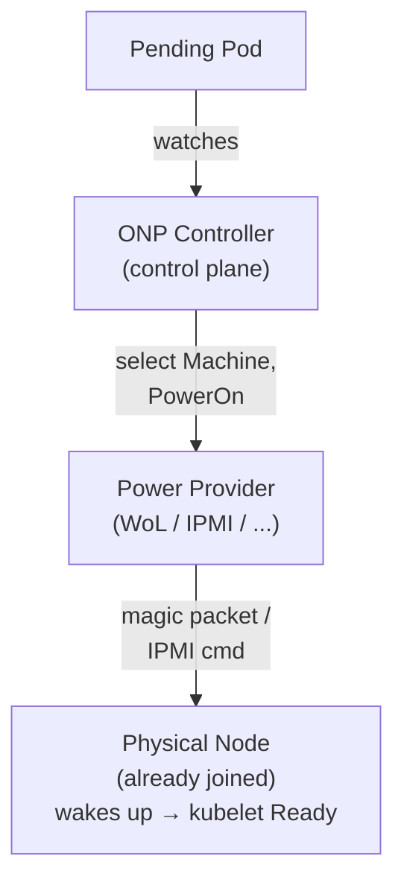
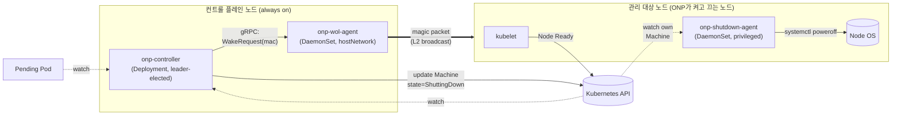
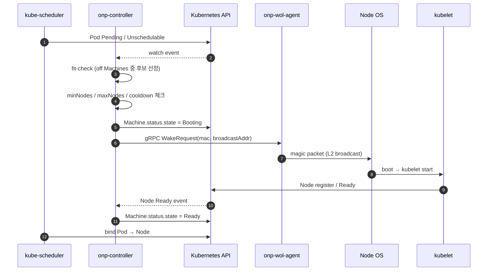
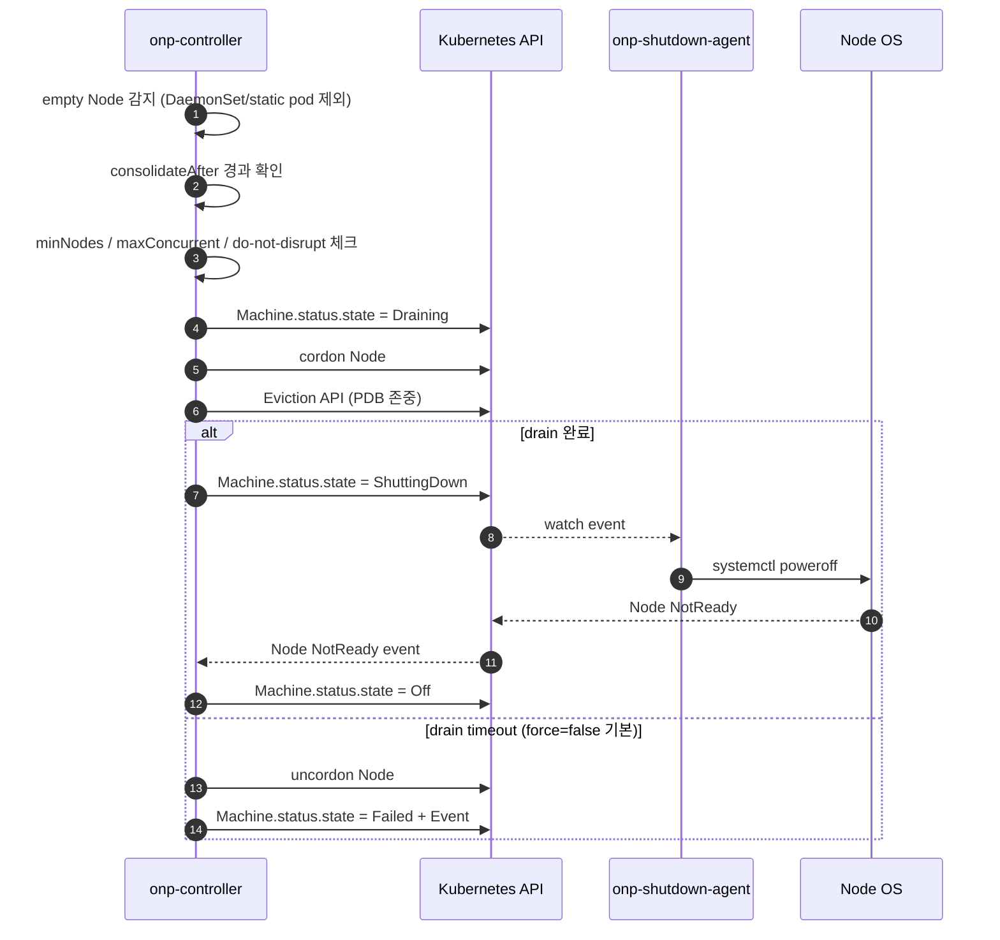
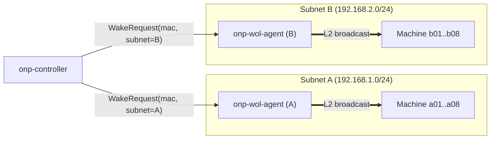

# ONP — On-Prem Node Provisioner

> 한 줄 요약: Pending 파드의 요구사항을 보고, 적합한 on-prem 물리 노드를 Wake-on-LAN으로 깨우고, 비면 안전하게 drain 후 전원을 끄는 Kubernetes 컨트롤러. 전원 제어는 pluggable.

상태: Draft
대상 독자: 오픈소스 사용자 / 컨트리뷰터
범위: Phase 1 (MVP)

---

## 1. Context and Scope

### 배경: on-prem에서의 노드 스케일링

Kubernetes 클러스터의 노드 수를 워크로드에 맞게 조절하는 일은 클라우드에서는 잘 풀린 문제다. AWS/GCP/Azure에는 [Cluster Autoscaler (CA)](https://github.com/kubernetes/autoscaler)와 [Karpenter](https://karpenter.sh/)가 있고, 두 도구 모두 "필요하면 새 VM을 만들고, 안 쓰면 지운다"는 전제 위에 만들어졌다.

on-prem 환경에서는 이 전제가 깨진다. 물리 노드는 **만들고 지우는 자원이 아니라, 켜고 끄는 자원**이다. 하드웨어 대수는 고정되어 있고, 비용은 "켜져 있는 시간"에 비례한다 (전력, 냉각, 소음, 그리고 홈랩이라면 가족의 불만). 그래서 on-prem 노드 스케일링의 본질은 다음 둘로 좁혀진다:

1. 어떤 워크로드가 들어왔을 때 **어느 노드를 깨워야 하는가**
2. 노드가 비었을 때 **언제, 어떻게 안전하게 끄는가**

OS 설치, 이미지 굽기, 클러스터 join 같은 "노드를 만드는" 문제는 ONP의 관심사가 아니다. 그 부분은 운영자가 이미 한 번 해두었다고 가정한다.

### 기존 솔루션 풍경

- **Cluster Autoscaler (CA)**: 클라우드 nodeGroup (ASG, MIG 등) 위에서 동작. on-prem용 어댑터는 거의 없고, 있어도 "VM 풀" 추상화를 강제한다. 물리 노드의 켜고/끄기 모델과 맞지 않는다.
- **Karpenter**: pending 파드의 실제 요구사항(리소스, nodeSelector, tolerations, affinity)을 보고 적합한 인스턴스 타입을 선택해 프로비저닝하는 workload-aware autoscaler. 단, 구현은 클라우드 provider API에 강하게 결합되어 있다.

### ONP의 자리

위 두 도구는 cloud 의 ephemeral 노드 모델("만들고 지운다")을 전제한다. ONP는 그 두 도구에서 검증된 패턴 — workload-aware 결정, 선언적 CRD — 을 on-prem 물리 노드 환경으로 옮기고, on-prem 특유의 요구인 **전원 제어**를 일급 인터페이스로 끌어들인다.

|                | 워크로드 인지        | 선언적 모델 (CRD) | 전원 plugin | 대상 환경 |
| -------------- | -------------------- | ----------------- | ----------- | --------- |
| CA             | O (nodeGroup 단위)   | -                 | -           | 클라우드  |
| Karpenter      | O (pod 단위)         | O                 | -           | 클라우드  |
| **ONP**        | O (pod 단위)         | O                 | O (일급)    | on-prem   |

핵심 차별점은 셋이다:

1. **Workload-aware, proactive**: pending 파드의 spec을 직접 보고 "이 파드에 맞는 노드"를 깨운다. 노드 사용률이 임계치를 넘기를 기다리지 않는다.
2. **선언적 CRD 모델**: `NodePool`로 정책을, `Machine`으로 개별 물리 노드를 표현한다. 정적 config 파일이 아니라 Kubernetes 객체로 관리한다.
3. **Power Provider plugin 일급화**: 전원 제어는 인터페이스 뒤에 숨긴다. Phase 1은 WoL만 구현하지만, IPMI/Redfish/스크립트 등 다른 백엔드를 같은 모양으로 끼울 수 있도록 설계 시점부터 분리한다.

### 작동 모델 (요약)



스케일 다운은 반대 방향이다. 노드가 비면 컨트롤러가 cordon → drain → `state=ShuttingDown` 으로 표시하고, 해당 노드에 상주하는 shutdown-agent가 `systemctl poweroff` 한다.

### 이 문서의 스코프

이 문서는 **Phase 1 (MVP)** 의 설계 결정을 다룬다. Phase 1의 경계는:

- **단일 클러스터**, 단일 컨트롤 플레인에서 동작
- **WoL 전원 provider 하나**만 구현 (인터페이스는 일반화)
- **Machine은 운영자가 직접 등록** (자동 흡수 없음)
- **단순 fit 기반 노드 선택** (배치 bin-packing 없음)
- **`WhenEmpty` consolidation 정책만** (`WhenUnderutilized` 없음)
- **NodePool은 여러 개 허용** (라벨 셀렉터로 Machine 묶음)

Phase 1에서 의도적으로 다루지 않는 항목 — IPMI/Redfish provider 구현, consolidation, OS/kubelet 프로비저닝, 멀티 클러스터 등 — 은 Section 2의 Non-Goals와 Section 3 말미의 Future Work에서 분명히 한다.

## 2. Goals and Non-Goals

### Goals

- **Workload-aware proactive wake-up**: Pending 파드의 spec(리소스 request, `nodeSelector`, `tolerations`, required `nodeAffinity`)을 직접 보고, 그 파드를 받을 수 있는 물리 노드를 골라 깨운다. 사용률 메트릭이 임계치를 넘기를 기다리지 않는다.
- **안전한 스케일 다운**: 노드가 비어 있고 `consolidateAfter` 동안 유지되면 cordon → drain → 전원 off 순서로 줄인다. PDB(`PodDisruptionBudget`)를 존중하고, drain이 막히면 멈춘다.
- **선언적 CRD 모델**: 노드 풀의 정책은 `NodePool` 로, 개별 물리 노드의 신원/전원 메타데이터는 `Machine` 으로 표현한다. 정적 config 파일이 아니라 Kubernetes 객체로 관리한다.
- **Pluggable Power Provider**: 전원 제어는 `PowerProvider` 인터페이스 뒤에 숨긴다. Phase 1은 WoL 구현 하나만 싣지만, IPMI/Redfish/스크립트 등 다른 백엔드를 같은 모양으로 끼울 수 있다.
- **운영 안전장치**: NodePool 단위 `minNodes` 하한 보장, 노드 단위 `onp.io/do-not-disrupt` opt-out, drain `timeoutSeconds` 설정 가능. 기본값은 모두 "보수적으로 안전한 쪽".
- **표준 관측성**: `/metrics` 엔드포인트로 Prometheus 호환 메트릭(스케일 결정, 노드 상태 전이, drain 결과 등)을 노출한다.

### Non-Goals

- **OS/kubelet 설치, 노드 이미지 관리, PXE/cloud-init.**
  **이유**: 운영자가 한 번 해두는 일회성 작업이다. ONP는 "이미 클러스터에 join된 노드의 전원만 다룬다"는 가정 위에서 동작한다.
- **신규 노드의 cluster join.**
  **이유**: 처음 join하는 흐름은 부트스트랩/시크릿/네트워크 정책과 얽혀 도구 하나가 책임질 수 있는 범위를 넘는다. ONP는 단순 재기동만 책임진다.
- **노드 헬스 체크, 자가 치유, 하드웨어 진단.**
  **이유**: [Node Problem Detector](https://github.com/kubernetes/node-problem-detector) 등 기존 도구의 영역이다. ONP는 `Node.Status.Conditions` 의 `Ready` 신호만 신뢰한다.
- **파드 스케줄링 자체.**
  **이유**: kube-scheduler가 한다. ONP는 "이 노드를 깨우면 이 pending 파드가 스케줄될까?"를 내부 fit checker로 시뮬레이션할 뿐, 실제 바인딩에 관여하지 않는다.
- **Consolidation / bin-packing (Phase 1).**
  **이유**: Phase 1은 `WhenEmpty` 정책만 지원한다. 노드가 "덜 차 있다"는 이유로 워크로드를 재배치하는 `WhenUnderutilized` 는 안전성 검증 부담이 커서 Phase 2 이상으로 미룬다.
- **IPMI/Redfish provider의 실제 구현 (Phase 1).**
  **이유**: 인터페이스만 정의하고 검증한다. Phase 1에서 백엔드를 둘 이상 끌고 가면 인터페이스의 추상화 비용을 검증하기 전에 부채가 쌓인다.
- **멀티 클러스터, 멀티 테넌시.**
  **이유**: 단일 클러스터 단일 컨트롤러를 가정한다. 여러 클러스터에 걸친 노드 풀 공유는 권한 모델·리더 선출·전원 락의 복잡도를 한 단계 끌어올린다.
- **`--force` drain을 기본 동작으로.**
  **이유**: 기본값은 PDB와 graceful termination을 존중하고, 막히면 멈춘다. force/`disable-eviction` 류는 NodePool 단위 명시적 opt-in으로만 허용한다. "조용히 데이터를 잃는" 기본값은 만들지 않는다.

## 3. Design

### 3.1 Overview

ONP는 **세 개의 컴포넌트**로 쪼개진다. 한 개의 바이너리로 합치는 길도 있었지만, on-prem 환경의 두 가지 물리적 제약 — (a) WoL 매직 패킷은 L2 브로드캐스트라 컨트롤러 파드가 직접 송신하기 어렵다, (b) 노드 전원을 끄려면 누군가는 그 노드 위에서 명령을 실행해야 한다 — 때문에 자연스럽게 셋으로 나뉜다.

#### 컴포넌트

- **`onp-controller`** — Deployment, leader-elected (단일 active replica). 컨트롤 플레인 노드에 배치한다 (`node-role.kubernetes.io/control-plane` toleration). 모든 reconciliation 로직이 여기 모인다: `NodePool` / `Machine` watch, pending pod watch, fit 시뮬레이션(어떤 Machine을 깨우면 이 파드가 스케줄될까), drain orchestration, 상태 머신 전이. 외부 세계와의 부수 효과(전원 on/off)는 직접 하지 않고 두 agent에게 위임한다.

- **`onp-wol-agent`** — DaemonSet, `hostNetwork: true`. **항상 켜져 있는 노드(=컨트롤 플레인 또는 그에 준하는 노드)에만** 배치한다 (nodeSelector로 제한). 컨트롤러로부터 gRPC로 "이 MAC 주소로 매직 패킷 보내" 요청을 받아, 호스트 네트워크 인터페이스에서 L2 브로드캐스트로 송신한다. 상태를 가지지 않는다 — 받은 요청을 그대로 패킷으로 변환할 뿐.

- **`onp-shutdown-agent`** — DaemonSet, `privileged: true`, 호스트 PID/네트워크 namespace 진입. **관리 대상 노드(=ONP가 켜고 끄는 노드)에만** 배치한다. 자기 호스트에 대응되는 `Machine` 객체를 watch하다가 `state == ShuttingDown` 이고 drain이 완료된 시점에 `systemctl poweroff` 를 실행한다. 컨트롤러가 SSH나 IPMI credential을 들고 다닐 필요가 없다.

#### 왜 세 개로 쪼갰는가

세 컴포넌트는 운영 복잡도(이미지 3개, RBAC 3개, 업그레이드 순서)를 늘린다. 그럼에도 쪼갠 이유는 각 분리가 **단일 문제 하나**를 푼다는 점이 명확하기 때문이다.

- **wol-agent 분리**: WoL 매직 패킷은 보통 같은 L2 세그먼트의 브로드캐스트로 전달된다. 컨트롤러 파드는 CNI overlay 안에서 동작하므로 호스트 NIC에서 직접 브로드캐스트를 쏘기 어렵다 (CNI/플러그인마다 다르게 동작하고, 종종 막힌다). `hostNetwork` daemonset이 가장 단순한 해법이다. 컨트롤러를 `hostNetwork` 로 돌리는 길도 있었지만, 그러면 컨트롤러 전체가 CNI를 우회하게 되어 reconciliation 로직과 네트워크 정책 모델이 어그러진다. **트레이드오프**: 송신 책임만 떼서 작은 daemonset으로 만드는 게 깨끗하다.

- **shutdown-agent 분리**: 노드를 끄는 방법은 SSH, IPMI, agent 셋 중 하나다. SSH는 컨트롤러에 키를 보관해야 하고(시크릿 표면 확장), IPMI는 BMC 자격 증명과 네트워크 도달성에 의존한다(홈랩/소규모 환경에서 종종 부재). **자기 노드에서 `systemctl poweroff` 하는 agent**가 가장 가정이 적다. Phase 1은 이 경로 하나만 깊이 다루고, IPMI/Redfish는 Power Provider 인터페이스의 또 다른 구현으로 미래에 끼운다 (켜기 경로). 끄기 경로는 일관되게 agent.

- **반대 트레이드오프**: 세 컴포넌트는 분명히 한 개보다 무겁다. 하지만 위 두 제약(L2 브로드캐스트 송신, 노드 위 전원 명령)을 우회하는 다른 길은 모두 컨트롤러에 더 많은 권한과 시크릿을 모은다 — 보안 표면이 더 나빠진다. 셋은 이 제약 아래에서의 **최소 분할**이다.

#### 컴포넌트 다이어그램



점선은 watch, 굵은 화살표는 물리적 부수 효과(패킷 송신, 전원 차단), 일반 화살표는 API 호출이다. 컨트롤러는 노드와 직접 말하지 않는다 — 깨우기는 wol-agent에, 끄기는 shutdown-agent에 위임한다. 두 agent는 어느 쪽도 상태를 가지지 않으며, 권위 있는 상태는 항상 Kubernetes API 위의 `Machine` 객체에 있다.

### 3.2 API Sketch

ONP는 두 개의 CRD를 도입한다: `NodePool` (정책)과 `Machine` (개별 물리 노드의 신원/전원 메타데이터). 아래는 **디자인 결정과 직접 얽힌 필드만** 추린 sketch다. 전체 스키마(검증 룰, 기본값, optional/required 표시 등)는 별도 reference doc에서 다룬다.

#### `NodePool` (sketch)

```yaml
apiVersion: onp.io/v1alpha1
kind: NodePool
spec:
  minNodes: 1                       # 항상 켜져 있어야 할 최소 노드 수 (하한)
  maxNodes: 8                       # 깨워둘 수 있는 최대 노드 수 (상한)

  machineSelector:                  # 이 풀에 속하는 Machine을 라벨로 묶음
    matchLabels:
      onp.io/pool: gpu

  template:                         # 깨어났을 때 Node에 부여될 라벨/테인트 힌트
    labels: { ... }
    taints: [ ... ]

  disruption:
    consolidationPolicy: WhenEmpty  # Phase 1은 이것 하나
    consolidateAfter: 10m           # 빈 상태가 얼마나 유지돼야 끌지
    maxConcurrent: 1                # 풀당 동시에 내릴 수 있는 노드 수 (안전장치)

  cooldown:
    scaleUp: 1m                     # wake 결정 사이 쿨다운
    scaleDown: 5m

  drain:
    timeoutSeconds: 300
    force: false                    # 기본 false. 명시적 opt-in.
```

#### `Machine` (sketch)

```yaml
apiVersion: onp.io/v1alpha1
kind: Machine
metadata:
  name: node-a01                    # = Node 이름 (Phase 1)
  labels:
    onp.io/pool: gpu
spec:
  nodeName: node-a01                # Phase 1은 metadata.name과 같음

  capacity:                         # 꺼져 있을 때의 fit 계산용 (source of truth)
    cpu: "16"
    memory: 64Gi
    nvidia.com/gpu: "1"

  labels: { ... }                   # NodePool.template과 합쳐져 Node에 적용

  power:
    provider: wol                   # discriminated union by provider
    wol:
      macAddress: "aa:bb:cc:dd:ee:ff"
      broadcastAddress: "192.168.1.255"

  shutdown:
    provider: agent                 # Phase 1은 agent 하나

status:
  state: Off                        # Off | Booting | Ready | Draining | ShuttingDown | Failed
  conditions:                       # 표준 컨디션 패턴
    - type: PowerOnSucceeded
      status: "True"
      lastTransitionTime: ...
```

#### 핵심 트레이드오프

**`capacity` 를 spec에 두는 것.** 가장 자연스러운 자리는 `status` 다 — 실제 capacity는 노드가 켜진 뒤 kubelet이 보고하는 값이다. 그러나 ONP의 핵심 결정(fit check)은 **노드가 꺼진 상태에서** 일어난다. 꺼진 노드에서 status는 stale 하거나 비어 있다. 그래서 spec에 두고 **운영자가 정확히 적는 것**을 source of truth로 삼는다. 비용은 명백하다: 사람이 잘못 적으면 컨트롤러가 잘못된 fit 결정을 내린다. 이를 보완하려고 노드가 Ready 된 뒤 `Node.Status.Capacity` 와 비교해 어긋나면 Event/Condition으로 경고한다 (자동 수정은 하지 않는다 — 운영자의 의도일 수 있으므로).

**`Machine.name = Node.name`.** 두 이름을 분리하면 노드 교체(같은 자리의 다른 하드웨어)를 깔끔하게 표현할 수 있다는 장점이 있다. 하지만 Phase 1에서는 두 이름의 일대일 매핑이 디버깅 단순함을 훨씬 크게 사 준다 — `kubectl get machine node-a01` 과 `kubectl get node node-a01` 이 같은 노드를 가리킨다. 노드 교체는 Machine 객체를 삭제·재생성하는 흐름으로 처리하고, 분리 가능성은 Phase 2 이상에서 다시 본다.

**`machineSelector` (label) vs `ownerReference`.** ownerReference는 풀과 머신의 강결합을 표현하기 좋지만, ONP의 운영 모델은 "운영자가 Machine을 먼저 등록하고, 나중에 NodePool이 라벨로 묶는다"이다. ownerRef는 등록 순서에 종속되고, Machine을 풀에서 잠시 빼거나 옮기는 일이 라벨 한 줄 수정이 아니라 객체 수정이 된다. Kubernetes 관례(예: `Service` → `Pod` 라벨 셀렉터)와도 결을 같이 한다. **반대 트레이드오프**: 한 Machine이 두 NodePool에 동시에 매칭될 수 있다 — 이 경우 컨트롤러는 충돌을 감지해 Event로 알리고 reconcile을 보류한다.

### 3.3 Key Workflows

스케일 업과 스케일 다운은 ONP의 두 핵심 워크플로다. 두 흐름 모두 **`Machine.status.state` 를 단일 진실의 원천**으로 삼는 상태 머신 위에서 돈다 — 컨트롤러와 두 agent 사이의 조율을 RPC choreography가 아니라 CRD watch로 한다.

#### Scale-up



`bootTimeout` (NodePool 설정, 기본 10분) 내에 Node Ready 가 관찰되지 않으면 컨트롤러는 `Machine.status.state = Failed` 로 옮기고 Event를 발생시킨다. 재시도 정책은 Phase 2.

#### Scale-down



#### 핵심 트레이드오프

**CRD를 상태 머신의 source of truth로.** 대안은 컨트롤러 ↔ shutdown-agent 사이의 직접 RPC(예: 컨트롤러가 agent에게 "이제 꺼" 호출)였다. RPC choreography는 한 흐름을 코드 한 곳에서 따라가기 쉽다는 장점이 있지만, 컨트롤러가 재시작되면 in-flight 호출의 상태가 휘발된다. CRD 기반은 컨트롤러가 언제 죽었다 깨어나도 `Machine.status` 만 보고 같은 자리에서 reconcile 을 이어갈 수 있다 (idempotent). shutdown-agent와의 통신을 별도 채널 없이 watch 하나로 끝낼 수 있다는 부수 효과도 크다. **비용**: CRD update 한 번 더 들어가는 latency, 그리고 상태 전이가 코드 한 줄이 아니라 reconcile 두 번에 걸쳐 일어나 인과 추적이 살짝 간접적이라는 점.

**Drain 실패의 기본 동작.** 세 선택지가 있었다: (a) force 로 밀어버린다, (b) 멈춘다, (c) 설정 가능하게 둔다. (c)를 골랐고 기본값은 (b). 디자인 doc의 Non-Goals에 적은 원칙 — "조용히 데이터를 잃는 기본값은 만들지 않는다" — 의 직접 적용이다. force 는 NodePool 단위 `drain.force: true` 로 명시적 opt-in 해야 켜진다. 이 결정의 비용은 운영자가 한 번은 drain 실패 알람을 받고 손으로 풀어야 한다는 점인데, on-prem 환경에서는 그 편이 안전하다.

**WoL 송신 후 성공 판정.** WoL 매직 패킷은 ack 가 없다 — 패킷이 NIC 에 도달했는지, 도달했는데 BIOS 가 무시했는지, 부팅 중간에 멈췄는지 구분할 수 없다. 그래서 ONP 는 송신 자체의 성공이 아니라 **Node Ready 신호**를 성공의 정의로 삼는다. `bootTimeout` 내 Ready 가 안 오면 Failed. 이 모델은 IPMI/Redfish provider 가 들어와도 그대로 쓰인다 — 전원 명령의 ack 가 있더라도 노드가 실제로 join 했다는 보장은 결국 Node Ready 뿐이다.

### 3.4 Pluggability

전원 제어는 `PowerProvider` 인터페이스 뒤에 숨긴다. Phase 1은 WoL 구현 하나만 싣지만, 인터페이스 모양은 IPMI/Redfish/스크립트가 들어올 자리를 처음부터 비워둔다.

#### 인터페이스 (개념)

```
PowerProvider:
    Name() string
    PowerOn(ctx, Machine) error
    PowerOff(ctx, Machine) error
    PowerStatus(ctx, Machine) (State, error)
    Capabilities() { CanPowerOn, CanPowerOff, CanQueryStatus }
```

호출 측은 메서드를 무조건 부르지 않는다. `provider.Capabilities().CanPowerOff` 같은 가드를 거쳐 분기한다. WoL provider는 `{CanPowerOn: true, CanPowerOff: false, CanQueryStatus: false}` 를 반환하고, `PowerOff` / `PowerStatus` 는 호출되지 않는다 (호출되면 명시적 `ErrUnsupported`).

#### 핵심 트레이드오프

**Symmetric interface + Capabilities 패턴 vs 각 capability 별 interface 분할.** 대안은 `PowerOn`, `PowerOff`, `PowerStatus` 를 세 인터페이스로 쪼개고 provider 가 필요한 것만 구현하는 모양이었다 (Go에서는 type assertion, 다른 언어에서는 mixin). 그러나 ONP의 호출 측은 항상 "이 머신의 전원을 켜라/꺼라"를 동적으로 판단한다 — 컴파일 타임에 어떤 인터페이스를 만족하는지가 아니라 런타임에 capability를 본다. 단일 인터페이스 + Capabilities 가 등록·검색·로깅 모두 단순하다. 인터페이스 폭이 작아서 미사용 메서드 4~5개를 들고 다니는 비용도 작다.

**WoL의 비대칭성을 인터페이스 차원에서 받아들임.** WoL은 정의상 `PowerOn` 만 가능하다 — PowerOff 도, PowerStatus 도 없다. 이 비대칭을 숨기려고 "fake PowerOff = 그냥 에러" 같은 구현을 강제하는 대신, **Capabilities 가 명시적으로 false 를 반환**하게 한다. 호출 측이 capability 를 보고 분기하는 모델이 정직하다.

**Shutdown-agent와 `provider.PowerOff` 의 역할 분담.** Phase 1은 **항상 shutdown-agent로 끈다** — `provider.PowerOff` 는 호출하지 않는다. 이유는 일관성: 어떤 provider 가 들어오든 끄는 방법이 한 가지면 운영자가 추론할 변수가 줄어든다. in-cluster 경로(`systemctl poweroff` via agent)는 OS 가 정상 작동 중이라는 가정 위에서 가장 안전하다. `provider.PowerOff` 는 비워두는 게 아니라, **노드가 무응답이라 in-cluster 경로로 끌 수 없을 때의 hard-cut** 시나리오(IPMI chassis power off 등)용으로 자리를 잡아둔다 — Phase 2 이상에서 fallback 으로 활성화.

**Provider config의 discriminated union.** `Machine.spec.power.provider: wol` + `power.wol: {...}` 모양. 새 provider 가 추가되어도 기존 Machine 객체에 영향이 없고, CRD validation 도 `provider` 값에 따라 oneOf 로 강제할 수 있다. 표준 Kubernetes convention (예: `Volume.spec` 의 source 분기) 과 결을 같이 한다.

**Capabilities 는 정적.** "런타임에 probing 해서 capability 를 자동 발견" 도 가능했다 (예: IPMI 서버에 query 보내 PowerStatus 지원 여부 확인). 정적으로 둔 이유는 단순함이 이기는 영역이라서다 — WoL이 갑자기 PowerOff 를 지원하게 되는 일은 없다. probing 의 복잡도(timeout, 캐시, 무효화)는 얻는 것에 비해 비싸다.

### 3.5 Future Work

Phase 1 이후 항목들의 **목록**이다. 각 항목의 설계는 그 시점에 별도 mini doc 으로 다룬다.

**Phase 2 (운영성)**
- **배치 스케줄링 + bin-packing**: 여러 pending 파드를 한꺼번에 보고 최소 노드 집합을 깨움.
- **`WhenUnderutilized` consolidation**: 덜 차 있는 노드의 워크로드를 재배치하고 끔.
- **IPMI provider**: full bidirectional 제어 (PowerOn / PowerOff / PowerStatus 전부).
- **부트 실패 retry / backoff 정책**: 현재 Failed 단방향에서 재시도 가능 상태로.
- **CRD validation webhook**: capacity 음수, 충돌 selector, 잘못된 provider config 등 거절.
- **Dry-run 모드**: "이 결정을 내릴 뻔했다" 로그만, 실제 wake/shutdown 안 함.

**Phase 3 (확장)**
- **Redfish provider**: BMC 표준.
- **Script provider**: escape hatch (사용자 정의 셸 스크립트).
- **노드 OS 업데이트 윈도우**: 꺼진 노드를 주기적으로 깨워 패치 적용 후 다시 끔.
- **Multi-cluster** (선택): 여러 클러스터가 같은 물리 노드 풀을 공유.

Phase 1 설계의 **숨은 제약**은 이것이다: 위 항목들이 추가될 때 Phase 1의 핵심 인터페이스(`PowerProvider`, `NodePool` / `Machine` CRD 스키마)가 깨지지 않아야 한다. 예컨대 IPMI provider 추가는 `PowerProvider` 인터페이스의 새 구현체 등록만으로 끝나야 하고, `WhenUnderutilized` 추가는 `disruption.consolidationPolicy` enum 확장만으로 끝나야 한다. 깨질 것 같으면 Phase 1 단계에서 미리 조정하는 게 옳다 — 이 doc의 API sketch 가 그 검증의 출발점이다.

## 4. Alternatives Considered

ONP의 목표 — workload-aware proactive wake-up + 선언적 CRD + pluggable power provider, on-prem 물리 노드 대상 — 를 합리적으로 달성할 수 있었던 다른 설계 셋을 검토했다. 각 대안의 트레이드오프와 거절 이유를 짧게 정리한다.

### 4.1 Karpenter fork

[Karpenter](https://karpenter.sh/) 는 workload-aware + pluggable provider 패턴이 이미 정착한 autoscaler 다. NodePool/NodeClaim 추상화, fit 시뮬레이션, consolidation 정책까지 우리가 원하는 것의 상당 부분이 있다.

**트레이드오프**: Karpenter 의 추상화는 **클라우드의 ephemeral 노드 모델**에 깊이 맞춰져 있다. `NodeClaim` 은 인스턴스 타입 카탈로그에서 새 VM을 만드는 것을 전제로 하고, lifecycle 은 provision → register → drain → delete 이다. 물리 노드의 long-lived 모델로 옮기려면 — 같은 노드 객체가 반복해서 `state=Off → Ready → Off` 를 오가는 — `NodeClaim` 의 ephemeral 가정 자체를 깨야 한다. 거기에 instance type 카탈로그, spot/on-demand, provisioner 의 capacity-type 분기 등 우리에게 의미 없는 추상화가 코어에 박혀 있다. 뜯어내는 비용은 from-scratch 보다 크다고 판단했다. 한편 Karpenter 의 fit 시뮬레이션 알고리즘은 ONP 가 **참고는 하되 코드는 다시 쓴다** — 라이선스/호환성 부담이 없고, 우리가 다룰 케이스가 훨씬 작다.

### 4.2 Cluster API + custom infrastructure provider

[Cluster API (CAPI)](https://cluster-api.sigs.k8s.io/) 의 `Machine` / `MachineDeployment` 모델 위에 ONP 를 infrastructure provider 로 구현하는 길.

**트레이드오프**: CAPI 는 **머신 라이프사이클 전체**(provision → bootstrap → join → decommission)를 다루는 도구다. ONP 가 원하는 건 그 라이프사이클 중 마지막 단계 — "이미 join 된 머신의 전원만". CAPI infra provider 로 구현하면 provision / bootstrap / join 단계 대부분을 no-op 으로 채워야 하고, 그 추상화가 도리어 단순한 전원 관리를 가린다 — 운영자가 "왜 InfrastructureMachineTemplate 이 필요하지?" 같은 질문에 답해야 한다. 또 하나의 실용적 문제: **`Machine` CRD 이름 충돌**. CAPI 가 `cluster.x-k8s.io/Machine` 을 점유하고, ONP 가 `onp.io/Machine` 을 도입하면 두 객체가 같은 클러스터에 공존하며 운영자 혼동의 원인이 된다. Phase 2 에서 `PhysicalMachine` 등으로 rename 하는 옵션을 열어둔다 — 이 결정 자체가 alternatives 의 잔재다.

### 4.3 정적 스크립트 + cron

가장 단순한 대안: Prometheus 알람 + 셸 스크립트 + WoL/SSH. cron 으로 주기 실행.

**트레이드오프**: 시작 비용은 가장 낮다. 작은 홈랩에서는 실제로 잘 작동한다. 그러나 의미 있는 규모로 확장하는 순간 — 선언적 관리, PDB 존중, 동시성 제어, 리더 선출, 관측성, 안전한 drain — 이 모든 운영 안전장치를 셸에서 다시 만들어야 한다. 그 시점에는 결국 컨트롤러를 만들고 있게 된다. ONP 는 처음부터 이 안전장치들을 일급으로 다룬다.

## 5. Cross-cutting Concerns

### Security

세 컴포넌트는 각자 다른 권한 표면을 가진다. 권한은 모두 **그 컴포넌트가 자기 일을 하는 데 필요한 최소치**로 제한한다.

- **onp-shutdown-agent**: `privileged: true`, `hostPID`, `hostIPC` — `systemctl poweroff` 를 호스트 init 에 전달하려면 필요하다. 블래스트 반경은 두 가지로 통제한다. (a) Pod Security Admission `privileged` 네임스페이스로 격리 — 다른 워크로드가 같은 PSA 레벨로 흘러들지 않도록. (b) RBAC 는 **자기 호스트에 해당하는 `Machine` 의 read-only** 권한만. agent 가 다른 노드의 Machine 을 보거나 수정할 수 없다.
- **onp-wol-agent**: `hostNetwork: true`. gRPC 포트가 호스트 NIC 에 노출되므로 NetworkPolicy 로 컨트롤러 파드의 트래픽만 허용. 컨트롤 플레인 노드 외부에서 도달 불가능해야 한다.
- **onp-controller**: RBAC 최소화 — Pod / Node read, Pod eviction, `NodePool` / `Machine` read-write, Lease (leader election) read-write. Secret 접근은 Phase 1 에 없다 (WoL 은 자격 증명 불요).

**미래 provider 의 credentials**. IPMI / Redfish provider 가 들어오면 BMC 자격 증명이 필요해진다. 원칙은 **credentials 는 provider 코드 안에 머무름** — 컨트롤러 핵심은 credential 을 보지 않는다. 구체적으로는 provider 별로 `Secret` 참조를 `Machine.spec.power.<provider>` 에 두고, provider 구현이 자기 Secret 만 읽는 RBAC 로 분리한다 (Phase 2 설계 시 구체화).

### Observability

운영자가 ONP 의 행동을 외부에서 관찰할 수 있어야 한다. 세 채널로 노출한다.

**Metrics (`/metrics`, Prometheus 호환)**
- `onp_nodes_total{pool, state}` — 풀별 상태별 노드 수 (gauge).
- `onp_scale_up_latency_seconds` — pending 감지 → Node Ready 까지 (histogram).
- `onp_power_on_total{provider, result}` / `onp_power_off_total{provider, result}` — 전원 명령 발행 카운터.
- `onp_drain_failure_total{reason}` — drain 실패 사유별 카운터 (`pdb_blocked`, `timeout`, `eviction_error` 등).
- `onp_pending_unschedulable` — 시스템이 인지한 큐잉된 파드 수 (gauge).

**Kubernetes Events**: `Machine` / `NodePool` / 관련 `Pod` 에 발생. 운영자가 `kubectl describe machine node-a01` 만으로도 흐름을 따라갈 수 있어야 한다.

**Status Conditions**: `Machine.status.conditions` 에 표준 패턴. `PowerOnSucceeded`, `DrainSucceeded`, `Ready`. 각 condition 은 `lastTransitionTime` 과 `reason` 을 항상 가진다.

### Disruption Safety

스케일 다운은 데이터 손실 위험이 가장 큰 동작이다. 모든 안전장치는 한 자리에 모아둔다:

- **PDB 존중**: Eviction API 를 사용 — `kubectl drain` 과 동일한 동작.
- **`minNodes` 하한**: 풀이 minNodes 아래로 내려가는 스케일 다운은 거절.
- **`maxConcurrent`**: 풀당 동시에 Draining 상태인 노드 수 제한 (기본 1).
- **`onp.io/do-not-disrupt` 어노테이션**: Node 또는 Pod 단위 opt-out. 어노테이션이 붙은 Pod 가 있으면 그 노드는 스케일 다운 후보에서 제외.
- **`drain.timeoutSeconds`**: 설정 가능. 기본 300s.
- **`drain.force`**: 기본 `false`. timeout 시 멈춤. `true` 는 NodePool 단위 명시적 opt-in.

기본값은 모두 **보수적인 쪽**. "조용히 데이터를 잃는 기본값은 없다"가 일관된 원칙.

### Failure Modes

| 실패 | 컨트롤러 동작 | 비고 |
| --- | --- | --- |
| 부트 타임아웃 (`bootTimeout` 내 Node Ready 없음) | `Machine.status.state = Failed` + Event | retry / backoff 는 Phase 2 |
| 매직 패킷 손실 (WoL ack 없음) | 같음 — Node Ready 신호로만 성공 판정 | provider 일반의 원칙 |
| Drain 행 (PDB 등) | `Failed` + uncordon + Event | `force=true` opt-in 시 강제 진행 |
| 컨트롤러 재시작 | reconcile 재개 — `Machine.status` 가 source of truth | CRD-driven 상태 머신의 이점 |
| onp-wol-agent 도달 불가 | Wake gRPC 실패 → backoff retry → 일정 횟수 후 Machine Event | 컨트롤러는 Booting 상태로 옮기지 않고 Off 유지 |
| onp-shutdown-agent 도달 불가 | `ShuttingDown` 상태가 stuck → Event | Phase 2: provider.PowerOff fallback |

원칙은 일관된다: **모호한 성공은 만들지 않는다**. 의심스러우면 `Failed` 로 옮기고 사람을 부른다.

### Network

WoL 은 보통 같은 L2 세그먼트의 브로드캐스트로 전달된다. 이 물리적 제약이 wol-agent 의 배치를 정한다 — agent 는 **타깃 머신과 같은 서브넷에 있어야** 한다.



Phase 1 은 **단일 서브넷**을 가정한다 — wol-agent DaemonSet 인스턴스가 하나의 서브넷만 커버. 다중 서브넷이 필요해지면 (a) 서브넷별 wol-agent DaemonSet 을 별도 배치하고, (b) `Machine.spec.power.wol.subnet` (또는 동등한 라벨) 로 어느 agent 가 깨워야 할지 라우팅한다. 이 구조는 Phase 1 의 인터페이스를 깨지 않는다 — Phase 2 에서 mini doc 으로 다룬다.

### Leader Election

컨트롤러는 표준 `coordination.k8s.io/Lease` 를 사용해 단일 active replica 를 보장한다. 두 replica 가 동시에 reconcile 하면 같은 Machine 에 대해 모순된 전원 명령이 발행될 수 있다 — 이 위험을 처음부터 차단한다. 운영자는 replica 를 2~3 으로 두어 failover 시간을 줄이되, active 는 항상 하나다.
